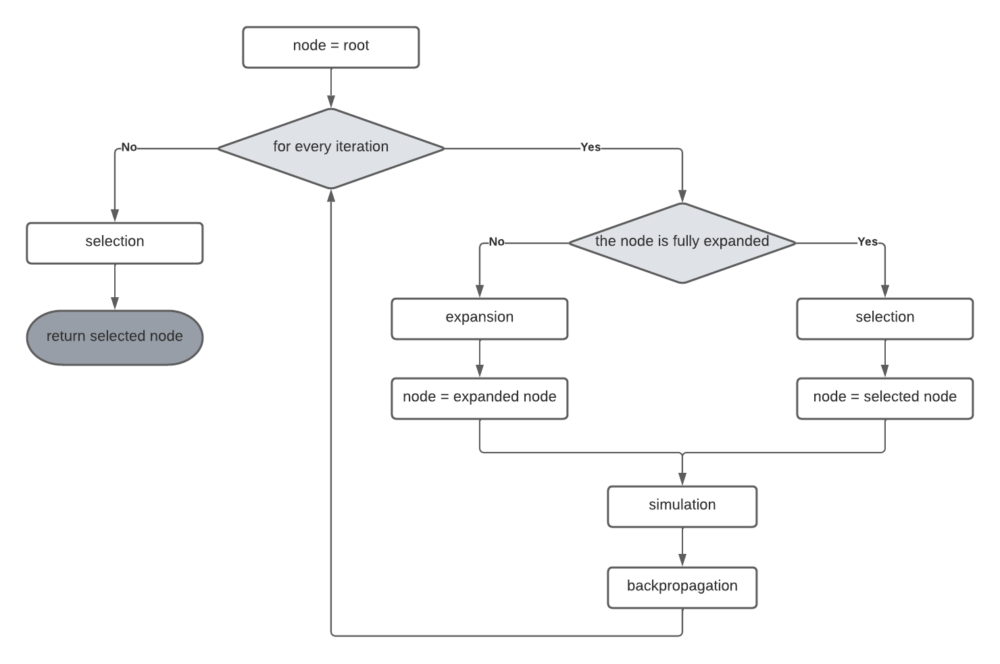

# Tic Tac Toe
Tic Tac Toe game made in C#, using WPF, with an AI using MCTS (Monte Carlo Tree Search) algorithm to determine the best move for the computer. The game can be played against the computer using the algorithm or against another human. The human starts first and the computer makes a move after right after.

## Requirements
- .NET 5.0
- Visual Studio (2019 preferably)

## User Interface

    

- top left: dropdown where you can choose to play against the computer or another human (1v1)
- top middle: start a new game (resets the moves on the board)
- top right: the number of iterations of the MCTS algorithm
- bottom: label where can be seen the game status

## Implementation
The current state of the board (after the human makes a move) will represent a node and this node will represent the root node in the MCTS algorithm. A node can have children (a child represents a board with a move made on the parent's board), score and a number of visits.

MCTS is composed of 4 steps: Selection, Expansion, Simulation and Backpropagation.

    

- Selection: if a node is fully expanded (has all child generated) selects the best child. To choose the best child is used UTC/UCB1 algorithm with the formula:  **child's score / child's visits + sqrt(2 * log(parent's visits) / child's visits)**.
- Expansion: if a node is not fully expanded create another child by making a move on parent's board.
- Simulation: simulate a game on the node's board with random moves (until someone wins or is a draw) and get a score seen from the computer's perspective, -1 for lose, 1 for win and 0 for draw.
- Backpropagation: goes from the node up to the root and add the score and increment the number of visits.

## Todo or Problems
- The AI does ok but sometimes the move it is making is not taking into consideration my next move. I don't know what I did wrong but is a small problem here.

## References
- [Code Monkey King - TicTacToe with MCTS](https://www.youtube.com/watch?v=-GRls60yRsQ&list=PLLfIBXQeu3aanwI5pYz6QyzYtnBEgcsZ8)
